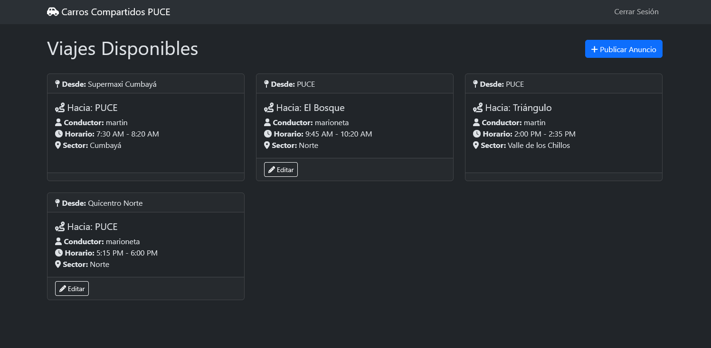

# Carros Compartidos PUCE - Dev Challenge 2025



Bienvenido al repositorio de Carros Compartidos PUCE, una app web para el agendamiento de viajes compartidos en la comunidad universitaria PUCE.

Impulsemos el transporte sostenible y ecológico!


## Instalación del ambiente

Instala el entorno virtual

```
python -m pip install virtualenv
```

Creación del entorno virtual

```
python -m venv .venv
```

Activación del ambiente

```
.venv\Scripts\activate
```

Instalación de dependencias

```
pip install -r requirements.txt
```
